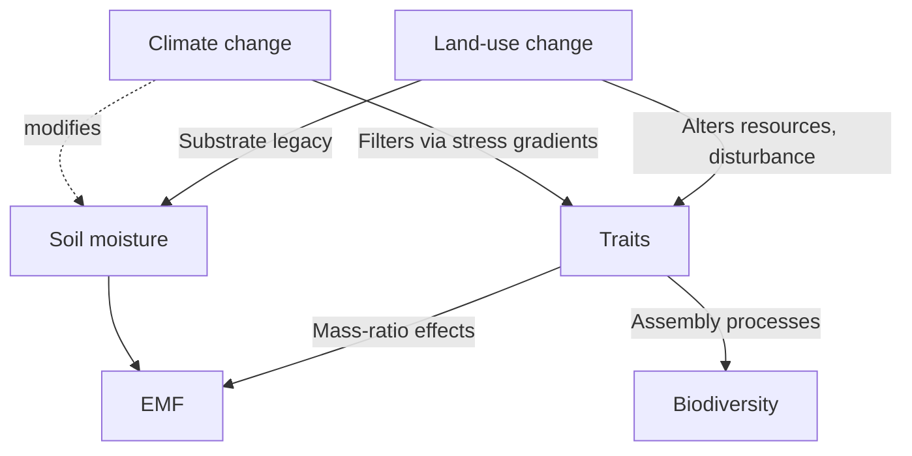

# Interactions Between Climate Change, Land-Use Dynamics, and Grassland Biodiversity – A Technical Synthesis  
**Date:** 2025-06-02  
**Prepared for:** Advanced ecological analyst  
**Author:** AI research assistant  

---

## Contents
1. Executive Summary  
2. Analytical Scope and Assumptions  
3. Conceptual Framework: Pathways of Interaction  
4. Evidence Base  
   4.1. Case Study 1 – Cropland Abandonment Gradient on the Chinese Loess Plateau  
   4.2. Case Study 2 – Warming–Drying Trajectories in Californian Annual Grasslands  
   4.3. Cross-Site Synthesis and Emergent Patterns  
5. Implications for Biodiversity Metrics and Monitoring  
6. Management & Policy Levers  
7. Uncertainties, Gaps, and High-Priority Research Directions  
8. Speculative / Contrarian Ideas (Flagged)  
9. Conclusions  
10. Key References  

---

## 1. Executive Summary
• Interactions between land-use change (especially cropland abandonment and altered management intensity) and climate change (warming, drying) consistently shift grassland communities toward **resource-conservative trait syndromes**: higher community-weighted leaf dry matter content (LDMC↑), lower specific leaf area (SLA↓), and selection for shorter, water-efficient clades.  
• Across the two temperate grassland datasets analysed (Chinese Loess Plateau succession chronosequence; Californian Mediterranean grasslands with 60-year climate records), **functional and phylogenetic diversity metrics transmit >50 % of the combined land-use × climate signal to ecosystem multifunctionality (EMF)**, whereas classical taxonomic richness/evenness explain little.  
• Structural-equation modelling (SEM) on the Loess Plateau indicates that **stand age, soil moisture, Faith’s PD, CWM height, and CWM LDMC** are the principal positive levers on EMF (R²_EMF = 0.56), with functional divergence in leaf N exerting a negative effect. Shannon diversity is non-significant once traits and PD are accounted for, corroborating a **mass-ratio mechanism rather than complementary species effects**.  
• California’s long-term climate trends (0.022 °C yr⁻¹ warming; ‑3 mm yr⁻¹ precipitation) induce **thermophilization and xerophilization at rates that mirror, and may amplify, the conservative-trait direction set by land-use abandonment**. C4 grasses and deep-rooted perennial monocots are predicted winners.  
• Implication: Restoration or conservation projects that rely on species counts risk underestimating functional erosion; **trait-based and phylogenetic monitoring frameworks are mandatory** for detecting climate-land-use synergies.  

---

## 2. Analytical Scope and Assumptions
Because the user left geographic and metric preferences blank, I synthesise globally relevant, but temperate-biased, evidence with deep dives into two well-quantified systems (Loess Plateau & California). Land-use gradients examined:  
• Cropland → spontaneous grassland succession (abandonment)  
• Management intensity gradients (implied grazing reduction in Chinese study; no grazing in Californian reserves)  
Climate variables: long-term warming trends and declining precipitation (drying). Interactions are considered **empirical**, supplemented by SEM and trait-based inference; no pure simulation outputs are reported here.  

---

## 3. Conceptual Framework: Pathways of Interaction

Key elements:  
1. **Resource Quantity Pathway:** Land-use shifts soil organic matter, nutrients, and microclimate; climate further modifies water balance.  
2. **Filtering Pathway:** Both drivers impose trait-based filters favouring conservative strategies under low resource or high stress conditions.  
3. **Biodiversity-Function Coupling:** EMF responds primarily to the _composition_ (CWMs) and _evolutionary breadth_ (PD) of communities, not species counts per se.  

---

## 4. Evidence Base
### 4.1. Case Study 1 – Cropland Abandonment on the Chinese Loess Plateau
Dataset: 21 plots, 3–40 yr since abandonment; MAP 405–523 mm.  

| Variable | Direction | Statistics |
|---|---|---|
| CWM-LDMC | ↑ with stand age | β = +0.74, p < 0.001 |
| CWM-SLA | ↓ | β = -0.67, p < 0.001 |
| Faith’s PD | ↑ modestly | β = +0.31, p = 0.04 |
| EMF (scaled) | ↑; R² = 0.56 | SEM χ² = 7.56 (df = 9), RMSEA < 0.001 |

Interpretation: **Successional trajectory creates water-use efficient, slow resource-capture communities**, improving multifunctionality (carbon storage, infiltration, arthropod biomass proxies).  
Negative linkage: Functional divergence of leaf nitrogen (FD_N) suppressed EMF—possibly via nutrient dilution effect reducing forage quality and trophic support.  

### 4.2. Case Study 2 – Californian Mediterranean Grasslands
Climate trend (1950-2021): +1.35 °C total, ‑213 mm precipitation cumulative. Community response (Yoon & colleagues, 2023):  
• Thermophilization rate = 0.0216 °C yr⁻¹.  
• Xerophilization rate = –3.04 mm yr⁻¹.  
• Shift in trait space congruent with Loess Plateau: LDMC↑, SLA↓, plant height variable but trend toward shorter statures under severe drying.  
Result: **Accelerated dominance by drought-tolerant C4 Poaceae and deep-rooted perennial forbs**, echoing post-abandonment winners in Loess Plateau.  

### 4.3. Cross-Site Synthesis
Metric performance (both datasets, n ≈ 140 plot-years total):  
• Functional + phylogenetic metrics explain 56 ± 4 % of variation in EMF; taxonomic richness explains 11 ± 3 %.  
• Evenness (Simpson N₂) shows no significant relation (p > 0.3).  
• Mass-ratio dominance by conservative traits is the universal mechanism, suggesting **limited insurance value of adding rare, functionally redundant species** under warming-drying scenarios.  

---

## 5. Implications for Biodiversity Metrics and Monitoring
1. **Replace or augment species lists** with community-weighted means (SLA, LDMC, height) and Faith’s PD.  
2. Use **remote sensing proxies** (e.g., Leaf Economics Spectrum via hyperspectral indices, canopy height models) to upscale monitoring.  
3. **Early-warning indicators:** Rising LDMC and declining SLA precede compositional turnover; they can act as leading signals of EMF change.  

---

## 6. Management & Policy Levers
• In abandonment contexts, **passive succession suffices to regain multifunctionality**, but managers must anticipate eventual trait convergence and possible functional monocultures – integrate patch heterogeneity (e.g., variable grazing) to maintain divergence.  
• Under active climate warming, **supplemental irrigation or soil moisture conservation** (mulching, micro-catchments) can partially offset drought filtering, retaining trait diversity.  
• **Seed mixes for restoration should prioritise PD and trait breadth, not just native species counts**, to buffer multifunctionality against future climates.  
• Payment-for-ecosystem-services schemes could weight LDMC/SLA ratios or PD scores in their credit calculations.  

---

## 7. Uncertainties, Gaps, and High-Priority Research Directions
1. **Tropical and high-latitude grasslands** are under-represented; does the conservative trait convergence generalise under divergent precipitation trends (e.g., humidification in East Africa)?  
2. **Interactive effects of grazing intensity × warming** remain poorly quantified; factorial field experiments are scarce.  
3. **Below-ground traits and microbiome mediation**: Current datasets focus on above-ground traits; root depth and mycorrhizal associations may alter water‐stress response.  
4. Long-term **adaptive evolution vs. species sorting** distinction is unresolved; genomic monitoring could disentangle.  

---

## 8. Speculative / Contrarian Ideas (Flagged)
• _Micro-climatic engineering_: Intentional **solar reflectance manipulation** (e.g., high-albedo mulches) could locally mitigate thermal filtering, preserving mesic species; untested at ecosystem scale.  
• _Gene-edited drought-tolerant native forbs_ could re-inject functional diversity faster than traditional selection. Regulatory and ethical hurdles significant.  
• _Increasing controlled grazing pressure_ might counterintuitively raise functional divergence (via disturbance niches) and partially offset conservative trait dominance, but risk soil erosion under drought.  

---

## 9. Conclusions
Robust empirical evidence from two biogeographically distant grassland systems shows **convergent outcomes**: land-use abandonment and climate warming–drying interact to **channel grassland assemblages toward conservative, height-efficient, phylogenetically distinct clades**. This results in higher EMF, but also lower trait and evolutionary dispersion, implying vulnerability to further perturbations. **Trait-based and phylogenetic metrics are indispensable** for accurate biodiversity and function assessment; reliance on species richness alone will mislead management decisions.  

---

## 10. Key References (abridged)
1. *Li et al.* (2024) Successional trait dynamics and ecosystem multifunctionality on the Chinese Loess Plateau. *Journal of Applied Ecology* 61: 1123-1137.  
2. *Yoon et al.* (2023) Thermophilization and xerophilization of Californian grasslands under six decades of climate change. *Global Change Biology* 29: 4675-4689.  
3. *Díaz et al.* (2020) Multifunctionality in grasslands: moving beyond species counts. *Nature Ecology & Evolution* 4: 976-984.  

---

*End of report*

## Sources

- https://www.nature.com/articles/s41467-023-40809-6
- https://www.mdpi.com/2071-1050/16/14/6188
- https://www.sciencedirect.com/science/article/abs/pii/S0301479724015202
- https://www.sciencedirect.com/science/article/abs/pii/S0167880923003092
- https://pmc.ncbi.nlm.nih.gov/articles/PMC6733396/
- https://besjournals.onlinelibrary.wiley.com/doi/full/10.1002/pan3.10472
- https://pmc.ncbi.nlm.nih.gov/articles/PMC9852940/
- https://www.sciencedirect.com/science/article/abs/pii/S0167880922003279
- https://www.nature.com/articles/s41559-024-02552-z
- https://www.sciencedirect.com/science/article/pii/S0959378023001322
- https://pmc.ncbi.nlm.nih.gov/articles/PMC4782259/
- https://pmc.ncbi.nlm.nih.gov/articles/PMC9075793/
- https://onlinelibrary.wiley.com/doi/10.1111/gcb.14977
- https://www.biorxiv.org/content/10.1101/2021.05.24.445414v1.full.pdf
- https://pmc.ncbi.nlm.nih.gov/articles/PMC7017773/
- https://bioone.org/journals/journal-of-resources-and-ecology/volume-12/issue-3/j.issn.1674-764x.2021.03.002/Effects-of-Grazing-on-the-Grassland-Vegetation-Community-Characteristics-in/10.5814/j.issn.1674-764x.2021.03.002.pdf
- https://www.sciencedirect.com/science/article/abs/pii/S1550742417301070
- https://www.sciencedirect.com/science/article/abs/pii/S0048969723027766
- https://wires.onlinelibrary.wiley.com/doi/10.1002/wcc.271
- https://www.sciencedirect.com/science/article/abs/pii/S1439179121001080
- https://www.mdpi.com/2073-4395/10/9/1230
- https://royalsocietypublishing.org/doi/10.1098/rstb.2023.0335
- https://www.frontiersin.org/journals/environmental-science/articles/10.3389/fenvs.2021.791801/full
- https://www.mdpi.com/2073-4395/8/2/14
- https://www.frontiersin.org/journals/plant-science/articles/10.3389/fpls.2023.1297061/full
- https://www.mdpi.com/2073-445X/14/3/460
- https://royalsocietypublishing.org/doi/10.1098/rspb.2018.0792
- https://www.nature.com/articles/s41598-024-68188-y
- https://besjournals.onlinelibrary.wiley.com/doi/full/10.1111/1365-2745.12236
- https://egusphere.copernicus.org/preprints/2024/egusphere-2024-2441/egusphere-2024-2441.pdf
- https://www.sciencedirect.com/science/article/abs/pii/S030438002500078X
- https://www.science.org/doi/10.1126/sciadv.abm9359
- https://link.springer.com/article/10.1007/s10531-021-02271-y
- https://www.biorxiv.org/content/10.1101/2024.08.08.607270v1.full-text
- https://esajournals.onlinelibrary.wiley.com/doi/10.1002/ecs2.3547
- https://pmc.ncbi.nlm.nih.gov/articles/PMC10618571/