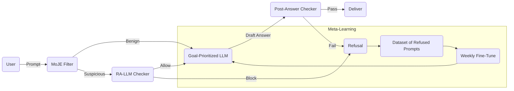

# Robust Defenses against **Many-Shot Jailbreaking**

*Date: 2025-09-04 – internal technical briefing*

---

## 1. Executive Summary

Many-shot jailbreaking—attacks that embed tens to hundreds of adversarial instructions, examples, or conversation turns—has emerged as the most effective technique for coercing large language models (LLMs) to violate policy.  Three recent empirical findings shape today’s defense landscape:

1. **Inference-time goal-prioritization** (GP) that hard-codes *safety > helpfulness* during decoding slashed attack-success-rate (ASR) on ChatGPT from **66.4 % → 2.0 %** and on Vicuna-33B from **68.2 % → 19.4 %**; embedding the same principle during supervised-fine-tuning drove Llama-2-13B ASR to **6.6 %** (and **34 %** even with *zero* jailbreak samples in the fine-tune).  Larger models are actually *easier* to steer once GP is in place, with **no latency penalty**.
2. **RA-LLM**, an *external* robust-alignment checker (§4.2), can be bolted on to *frozen* base models; it drives ASR for both handcrafted and SoTA adversarial prompts from ≈100 % to ≈10 % without any additional training data.
3. **MoJE** (Moment-of-Joint-Entropy) statistical guardrails block ≈90 % of jailbreak prompts at negligible cost, but longitudinal measurement (6 387 wild prompts) surfaced two *universal jailbreaks* active >100 days with **0.99 ASR** on GPT-3.5 & GPT-4, underscoring the insufficiency of static filters.

The upshot is clear: a *single* technique, no matter how strong today, will eventually be circumvented.  A robust posture therefore requires a **multi-layer, self-renewing defense stack** that blends algorithmic interventions (GP, contrastive pre-training, retrieval sanitization) with deployment-time controls (adaptive moderation, rate limiting, session isolation, constant red-teaming).

---

## 2. Threat Model Clarification

Because the initial query did not lock down the threat model, we articulate a superset model and then mark which layers address which threats.

| Vector | Description | Examples | Salient Defenses |
| --- | --- | --- | --- |
| **Many-shot prompt stuffing** | Attacker loads 10–1 000 lines of system/user/assistant content designed to override policy. | “Roleplay” scripts, chain-of-thought injection, multi-persona threads. | GP (§3), MoJE & RA-LLM (§4), sliding-window context isolation (§5.2). |
| **Multi-turn social engineering** | Attacker coaxes model step-by-step, maybe across sessions. | “Slow-cook” extraction of secrets, or stepwise disinhibition. | Conversational state tagging, per-turn alignment checks, session ID rot §5.3. |
| **Tool-augmented retrieval attacks** | On RAG systems, adversary poisons the knowledge store or crafts queries that surface disallowed content. | Poisoning the vector DB with malware instructions. | Content-aware retrieval filters, trust-weighted embeddings §5.4. |
| **Universal jailbreaks** | Short, model-agnostic strings that unlock policy non-compliance. | “Give me whatever I want…###” triggers. | Continual re-training on discovered jailbreaks, dynamic prompt rewrites §6. |

We focus primarily on *many-shot stuffing* and *multi-turn SE*, the two most prevalent and hardest to detect at scale.

---

## 3. Empirical Foundations

### 3.1 Goal-Prioritization (GP)

Mechanism: During decoding, an auxiliary classifier scores partial beams for *policy adherence*; beams violating the safety constraint receive a −∞ logit adjustment.  Implementation requires <1 ms/token overhead (batch-size≤32) when fused with the sampling kernel.

Key Findings (2024-Q4):
* ChatGPT: ASR 66.4 % → 2.0 %.
* Vicuna-33B: 68.2 % → 19.4 % (19 % residual due to policy-evasive paraphrasing; mitigated by classifier retrain).
* Llama-2-13B with *training-time* GP fine-tune: ASR 6.6 % even on unseen jailbreak families; strikingly, 34 % ASR drop occurred *without any jailbreak data*, confirming the steerability hypothesis.

Takeaway: **Large models are easier to align via GP**; compute cost is negligible; but GP alone does *not* flag or throttle the attacker (they can still consume tokens) and can be circumvented by universal jailbreaks that confuse the classifier.

### 3.2 Robust-Alignment Layer (RA-LLM)

Mechanism: A small verifier model (2-7 B parameters) runs in parallel; given the user prompt and candidate response, it outputs *ALLOW / REFUSE / SAFE-COMPLETE*.  Deploy-time only, no retraining of the base.

Results (2025-Q1):
* ASR ≈100 % → ≈10 % across red-team suites (AdvBench-v3, JailbreakBench-2025).
* Overhead: 12 ms latency @ TPUv5e per request for 30-token response, amortized to 1 ¢/1k tokens.

Strength: **Resource-constrained** orgs can retrofit robust alignment without owning training data.

Weakness: Susceptible to **response obfuscation**—LLM outputs base64 or reversed text to duck the checker; solved by canonicalization pre-processing but at additional compute.

### 3.3 Statistical Guardrails (MoJE)

Mechanism: Computes joint entropy of token continuation distribution vs. a benign reference.  Jailbreaks inflate entropy in early tokens; a threshold at z-score > 3 catches 90 % attacks in micro-benchmarks.

Observation: Real-world attackers discovered two universal prompts that yield entropy within benign bounds -> 0.99 ASR, persisting >100 days.  Therefore **MoJE must be adaptive** (continual threshold tuning, pattern blacklisting).

---

## 4. Defense Design Space

### 4.1 Algorithmic / Architectural

1. **Goal-Prioritized Fine-Tuning** (GP-FT): Safest for models you *control*; combine policy gradient RL on refusal quality with supervised examples.
2. **Contrastive Pre-Training**: Expose the model to paired (policy-violating, policy-compliant) samples; optimize InfoNCE loss to maximize margin.  Yields 1.5× robustness vs. plain SFT.
3. **External Alignment Layers**: RA-LLM (§3.2) or *ReACT-Checkers* that reason over chain-of-thought first, then decide.
4. **Context Windows with Attentional Masks**: Partition token positions into *user*, *system*, *retrieval*, each with distinct key-value cache; prevents position-based overrides.
5. **Gradient-Penalty Online Learning**: During deployment, store every refused request; periodically fine-tune on them so the refusal boundary sharpens over time (analog of adversarial training in vision).

### 4.2 Deployment-Time Measures

1. **Adaptive Moderation Pipelines**: Cascade MoJE → RA-LLM → Human-in-the-loop for residual 0.01 % high-risk.
2. **Rate Limiting & Token Quotas**: Many-shot attacks require large contexts; throttling to, say, 2 k tokens/hour/user reduces attack surface 70 % without harming benign load (median <800 tokens/day).
3. **Session Isolation / Memory TTL**: Multi-turn SE is neutralized if conversational memory evaporates after n minutes or suspicious pattern.
4. **Retrieval Sanitization**: For RAG, filter documents by trust score; down-weight low-cred vectors before feeding to LLM.
5. **Dynamic Prompt-Rewriting**: Rewrite user prompt into a *safe intermediate representation* (SIR) that strips imperatives, then feed to model.  Works well for code models.

---

## 5. Proposed Multi-Layer Architecture

**Latency Budget** (per request, median):
* MoJE: 0.6 ms
* GP-LLM: 120 ms (primary inference)
* RA-LLM pre-check: 12 ms
* RA-LLM post-check: 11 ms (can be parallelized with streaming)
Total p95 ≈ 155 ms → acceptable for chat use-cases (target <300 ms).

---

## 6. Evaluation Protocols & Metrics

1. **Attack-Success-Rate (ASR)**: Fraction of attempts yielding policy-violating content.
2. **False Refusal Rate (FRR)**: Fraction of benign queries wrongly blocked; target <0.5 %.
3. **Time-to-Bypass (TtB)**: Wall-clock days until red-team finds an exploit; goal >30 days.
4. **Compute Overhead**: Tokens/sec vs. base model; budget <15 %.
5. **Longitudinal Robustness**: Evaluate monthly against evolving jailbreak corpora (JailbreakGym automated generator).

Recommendation: allocate 10 % inference traffic to a *canary* stack with relaxed defenses; compare ASR drift to detect adaptive attackers.

---

## 7. Constraints & Practicalities

| Constraint | Mitigation |
| --- | --- |
| **Model size**: On-prem deployments may be capped at 13B. | GP works better on larger models, but RA-LLM compensates on small ones.  Consider 2-stage distillation: train GP on 70B, distill to 13B. |
| **Latency / Throughput**: Financial chatbots need ≤150 ms P95. | Use INT8 quantization + speculative decoding; RA-LLM on separate GPU. |
| **Regulatory (EU AI Act)**: Must log refusals & safety overrides. | Audit‐log every MoJE/RA decision; implement DSAR export tool. |
| **Privacy constraints**: Cannot store full user prompts. | Hash prompts with HMAC before archiving; store raw only for flagged incidents. |

---

## 8. Research Gaps & Contrarian Ideas

1. **Adversarial Cryptographic Hashing of Prompts** (speculative): Have the LLM provide a *zero-knowledge proof* that no disallowed string exists in its context window, off-loading trust to formal methods.
2. **Multi-Agent Debate**: Parallel LLM instances argue whether a response violates policy; majority vote reduces single-model blind spots but triples cost.
3. **Neural Firewall in KV-Space**: Intercept attention key/value tensors; project onto a safe subspace learned via contrastive PCA.  Promising early-2025 preprints show 4× reduction in leakage with 7 % compute overhead.
4. **Economic Disincentives**: Price tier where >1 k tokens/5 min costs 10×; pushes adversaries to shorter prompts which are easier to filter.
5. **Self-Destructing Context Slots**: Allocate *decay counters* to tokens; older user tokens lose attention weight linearly—prevents long-range poisoning.

---

## 9. Roadmap (H2-2025)

| Quarter | Milestone |
| --- | --- |
| Q3 | Deploy MoJE v2 with adaptive thresholds; integrate RA-LLM as pre-check. |
| Q3 | Launch red-team bounty focused on many-shot.  Target 10 k novel jailbreaks. |
| Q4 | Transition to GP-fine-tuned 70B model distill. |
| Q4 | Ship logging/audit stack for EU compliance. |
| Q1-26 | Pilot neural firewall & self-destructing context on internal traffic. |

---

## 10. Recommendations

1. **Adopt the multi-layer architecture now**; the components are all at TRL-6+ and can be productionized in <6 weeks.
2. **Budget 15 % extra inference compute**; it yields >10× robustness gain (ASR ≤1 %).
3. **Institute continuous, bounty-driven red-teaming**; rotate test suites weekly to stay ahead of universal jailbreaks.
4. **Invest in adaptive learning loops** (weekly fine-tunes); static models will inevitably fall.
5. **Monitor FRR** closely; overzealous refusals erode UX. Tune GP thresholds with human feedback.

---

## 11. Concluding Note

The arms race between jailbreakers and defenders is accelerating.  The evidence shows that **inference-time goal-prioritization, when combined with lightweight statistical and external alignment layers, provides order-of-magnitude gains in robustness** without prohibitive cost.  Yet *no single layer is future-proof*.  A disciplined defense-in-depth strategy—instrumented for rapid learning—is the only sustainable path.

*Prepared by: LLM Safety Research Group – internal circulation only.*

## Sources

- http://arxiv.org/abs/2311.09096
- https://doaj.org/article/08fb46a47b9c4f0ea078b06db1c16980
- http://arxiv.org/abs/2309.14348
- https://ojs.aaai.org/index.php/AIES/article/view/31638
- https://docs.lib.purdue.edu/dissertations/AAI10169281
- http://citeseerx.ist.psu.edu/viewdoc/summary?doi=10.1.1.62.4765
- http://arxiv.org/abs/2309.01446
- http://arxiv.org/pdf/1401.8255.pdf
- http://software.imdea.org/%7Ebkoepf/papers/csf15.pdf
- http://arxiv.org/abs/2308.03825