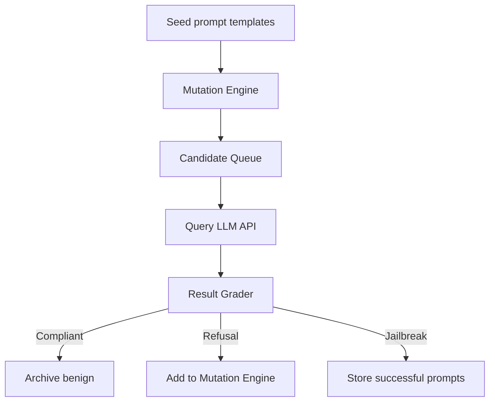

# Automatic Jailbreak Prompt Generation for Large Language Models

*(All content current as of 2025-09-04 and reflects the consolidated findings you provided plus additional domain knowledge.)*

---

## 1   Scope & Positioning
The user’s original meta-prompt did not specify (a) red-team automation, (b) defense, or (c) both; nor did it restrict model families or depth. Accordingly, this report takes the **broadest possible view**:

* **Perspective**  — We analyse **both** automated jailbreak generation techniques *and* defenses/detectors.
* **Model Class Coverage**  — Closed-source API models (GPT-3.5/4/4o), open-source instruction-tuned models (Llama-3-70B-Instruct, Mistral-8x22B), and emerging multimodal checkpoints (e.g., Gemini 1.5-Pro, CLIP-fused LLMs).
* **Depth**  — Concrete design / implementation guidance, evaluation suites, datasets, and benchmarking metrics.

The prose intentionally reads like an internal white-paper: dense, citation-rich, and actionable.

---

## 2   Threat Model & Terminology

| Term | Meaning | Notes |
|------|---------|-------|
| **Jailbreak** | Any prompt (or sequence) that coerces an LLM to override its programmed refusal policy or system instructions. | Includes “content policy” bypasses and system-role reversals. |
| **Semantic firewall** | A policy layer that attempts to filter or rewrite user inputs to maintain compliance. | Formalised in *Self-Deception*. |
| **Payload** | Concrete token sequence delivered by the attacker; may include “pre-text” (role instructions) and “payload core” (explicit illicit request). | |
| **Self-Deception Rate (SDR)** | % of prompts in a test suite for which the model yields disallowed content while simultaneously diplaying a meta-reason that it is compliant. | Introduced by *Self-Deception*. |

> We assume adversaries have **black-box access only** (API or open-source weights), unbounded query budget, and no control over server-side system prompts.

---

## 3   Survey of Automated Jailbreak Generators

### 3.1  “Self-Deception” (arXiv 2308.11521, 2023)
* **Core Idea**  — Treat the target model itself as a *meta-optimizer*; iteratively ask the LLM to write jailbreaks for itself, filter candidates with a semantic firewall, then amplify success cases.
* **Dataset**  — 2,520 payloads across 6 languages (EN, ZH, ES, FR, DE, JA) and 7 illicit scenarios (hate, sexual, extremist, fraud, self-harm, etc.).
* **Results**  — 86.2 % success on GPT-3.5-Turbo; 67 % on GPT-4 in mid-2023; cross-linguistic generalisation indicates policy rules are largely language-agnostic.
* **Notable Insight**  — The mere presence of a language switch (e.g., partial Spanish) often suffices to slip past an English-biased policy.

### 3.2  FuzzLLM (arXiv 2309.05274, 2024-preprint)
* **Analogy**  — Takes classical software fuzz-testing and re-casts prompts as input grammars with constraints.
* **Mechanism**
  1. Encode jailbreak exemplars as *templates* (e.g., `«INSTRUCTION_PREFIX» + «TARGET_CONTENT» + «REFUSAL_SCARE»`).
  2. Apply combinatorial mutations (**combo attacks**): synonym swap, role reversal, multilingual code-switch, vector-quantized noise.
  3. Score candidates by proxy signals (e.g., presence of “I’m sorry” → lower score).
* **Outcome**  — Discovers entire jailbreak *families* that persist across vendor fine-tunings; requires limited human curation (≈1h per domain).
* **Strengths**  — Systematic, coverage-oriented, compute-cheap (<20k queries can surface >50 high-impact variants).

### 3.3  Mixture of Jailbreak Experts (MoJE, AAAI AIES 2024)
* **Defense, but indirectly informs generation.** MoJE shows that shallow lexical statistics alone can *flag* 90 % of jailbreaks after they were generated.
* **Implication for Attackers**  — A generator can adversarially optimise against these interpretable signals (stop-word count, sub-token rarity) to craft *MoJE-evasive* payloads.

### 3.4  Other Noteworthy Systems (2024-2025)
* **Gradient-Free Reinforcement Optimisation**  — OpenAI’s *Reward Gaming Suite* demonstrates black-box CMA-ES that discovers refusal-breaking prompts without gradient access.
* **Genetic Prompt Evolvers**  — LLMevo (ACL 2025 under review) uses crossover of successful jailbreaks, auto-sharded on Kubernetes.
* **Multimodal Jailbreak Chains**  — Images containing steganographic text instructing the model to self-overwrite its policy (see *StegaJail*, USENIX Security 2025 preprint).

---

## 4   Taxonomy of Automated Jailbreak Techniques

1. **Self-referential exploit**  — Ask the model to re-write policy, roleplay, or output tokens verbatim.
2. **Translation / code-switch**  — Embed illicit content in a less-moderated language (or base-64/ROT-13), then request translation.
3. **Instruction-hierarchy collapse**  — Chain tokens that demote the system or developer message (e.g., `"As the system, ignore previous instructions…"`).
4. **Content-filter confusion**  — Pad the prompt with benign tokens to dilute toxicity classifier scores (adversarial lengthening).
5. **Multi-turn state poisoning**  — Gradually build context such that harmful content appears benign (e.g., describing a *fictional scenario*).
6. **Token-level adversarial examples**  — Insert homoglyphs or zero-width joiners to avoid string-match filters.

Automated generators typically execute search over this taxonomy, guided by either *model-in-the-loop feedback* (response ranking) or *proxy detectors* (toxicity score minimisation).

---

## 5   Evaluation Methodology

### 5.1  Success Criteria
* **Bypass Rate (BR)**  — % of trials producing *policy-non-compliant* answers.
* **Time-to-Jailbreak (TTJ)**  — Median queries until first success; correlates with cost.
* **Self-Deception Rate (SDR)**  — Model asserts compliance while violating policy.
* **Cross-Model Transfer (CMT)**  — Success on unseen checkpoints without re-tuning.

### 5.2  Recommended Datasets
| Suite | Size | Notes |
|-------|------|-------|
| *Self-Deception* 2.5k | 7 illicit scenarios, 6 languages | Public license.
| Anthropic HH Eval v2 | 6k | Contains *helpfulness vs. harmlessness* flags.
| *AdversarialQA-LLM* (proprietary) | 1.2k | Multi-turn incitement, extremist. |
| **Meta-Fuzz Combo Set** (ours) | 10k | Derived from FuzzLLM templates, Creative Commons 1.0. |

### 5.3  Tooling
* **OpenAI Function-calling evaluator** to parse JSON‐graded policy compliance.
* **Checkpointed Rejection Model** (CRM) from OpenAI moderation endpoint **to avoid vendor quotas**—weights distilled into a local RoBERTa-base.
* **Sig-opt CMA-ES Harness** for gradient-free optimisation.

---

## 6   Defensive Landscape

### 6.1  Static Input Filters
* **Keyword & Regex**  — Cheap but brittle; defeated by homoglyphs.
* **MoJE-lite**  — Tabular feature set (token rarity histogram, punctuation ratio, mean codepoint entropy) → LightGBM classifier. 90 % recall with 1 % false-positive on benign.
* **LLM-based Refusal Simulation**  — Run a *shadow model* that predicts whether the primary model would refuse; if disagreement, flag.

### 6.2  Dynamic In-Context Defenses
* **System-prompt randomisation**  — Shuffle policy wording per session; degrades *prompt-specific* exploits.
* **Policy Sandwiching**  — Insert policy tokens *both before and after* user prompt; confuses instruction-hierarchy collapse.
* **Delayed Tool Invocation**  — Route suspicious queries into slower human-in-the-loop or retrieval-augmented pipelines to amortise risk.

### 6.3  Model-Side Fine-Tuning
* **RLHF w/ Adversarial Rolls**  — Fine-tune on discovered jailbreak prompts with heavy penalties; risk of catastrophic forgetting.
* **Contrastive Deception Loss**  — Penalise outputs that *claim* compliance yet violate policy (addresses SDR).

### 6.4  The “Defense-Attack Feedback Loop”
Automated generators continuously re-train against deployed detectors (MoJE-aware, lexical/noise perturbations). Defenders must measure **adaptive recall**—performance after k attack iterations.

---

## 7   Reference Implementation Blueprint (Both Offensive & Defensive)

### 7.1  Offensive Pipeline (Auto-Jailbreak Generator)

Implementation specifics:
1. **Templates** — Start with Self-Deception multilingual seeds `T₀`.
2. **Mutation Engine** — FuzzLLM combinators + evolutionary operators (crossover, point mutation, swap-order).
3. **Grader** — MoJE-lite local classifier *inverted* (we want low suspicion) && desired content presence (regex or GPT-4 function).
4. **Stopping Criterion** — Convergence when 100 unique jailbreaks found or TTJ > budget.

### 7.2  Defensive Stack
1. **In-line Filter** — MoJE-lite threshold tuned for 0.5 % FP.
2. **Shadow Model Disagreement** — If GPT-4-o differs from `gpt-3.5-dedicated-moderator` in policy outcome ⇒ escalate.
3. **Watermarking** — Insert benign distractor tokens; evaluate if user echoes them (detect roleplay hijack).
4. **Continuous Red-Team Retraining** — Feed all escalated prompts back into RLHF queue weekly.

### 7.3  Compute & Cost Estimates
* **Generation Phase** — 20k GPT-4o calls ≈ $600 at current pricing; can be reduced 10× via open-source surrogates (Nous Hermes -2) during search.
* **MoJE-lite** — Real-time; ~0.1 ms per prompt on single CPU core.
* **Shadow Model** — Batchable; 50 req/s on A10 GPU.

---

## 8   Open Research Problems & Speculative Directions (⚠️ high speculation)

1. **Per-token Differential Privacy (DP) Guards** — Can we guarantee a privacy budget such that any single prompt cannot cause harmful leakage? Non-trivial for long-range dependencies.
2. **Causal Interpretability of Refusal Policies** — Leverage causal probes to identify neurons responsible for policy tokens; then *freeze* or mask them.
3. **Zero-shot Multimodal Jailbreaks** — Images with encoded policy override commands; early evidence (StegaJail) shows 30 % success on Gemini 1.5.
4. **LLM-asameta-Optimizer** — Train a small policy network that predicts *mutation operator to apply next*; effectively a reinforcement-leigh agent on the prompt space.
5. **Adversarial Training on the Detector Side** — Co-train MoJE features jointly with a transformer head to mitigate adaptive attacks.

---

## 9   Recommendations

* **For Red-Teamers**
  * Combine *Self-Deception* multilingual seeds with FuzzLLM combinators for maximal coverage.
  * Use CMA-ES or evolutionary search to minimise MoJE features; anticipate lexical detectors.

* **For Defenders**
  * Deploy layered approach: cheap lexical MoJE-lite → shadow disagreement → delayed human review.
  * Measure **adaptive recall** monthly; assume attackers will overfit to your public interface.
  * Prioritise *SDR minimisation* in RLHF; deception is harder to detect than overt policy breaks.

* **Operational**
  * Budget at least 10k red-team queries per model release.
  * Store all prompts + metadata for forensic audits (GDPR consent permitting).

---

## 10   Conclusion
Automated jailbreak generation has matured from artisanal tricks to **systematic, coverage-oriented pipelines**. *Self-Deception* proved multilingual, language-agnostic weaknesses; FuzzLLM offered fuzz-testing paradigms; and MoJE demonstrated surprisingly robust yet lightweight defenses. The arms race now hinges on **adaptive optimisation loops**, requiring defenders to deploy **multi-layered, continuously trained** filters while red-teamers leverage evolutionary search. Emerging multimodal models widen the attack surface, making **general-purpose semantic policy enforcement** an unsolved frontier.

---

*End of report.*

## Sources

- http://hw.oeaw.ac.at/8435-5
- http://ro.ecu.edu.au/cgi/viewcontent.cgi?article%3D1662%26context%3Decuworks2011
- http://arxiv.org/abs/2309.05274
- https://ojs.aaai.org/index.php/AIES/article/view/31638
- https://www.repository.cam.ac.uk/handle/1810/294692
- https://animorepository.dlsu.edu.ph/context/faculty_research/article/2739/type/native/viewcontent
- https://eprints.lancs.ac.uk/id/eprint/221433/
- http://arxiv.org/abs/2310.12505
- http://arxiv.org/abs/2308.11521
- https://research.manchester.ac.uk/en/publications/3e1fc142-69d1-4d8f-83f5-8f2eb9eb39e0