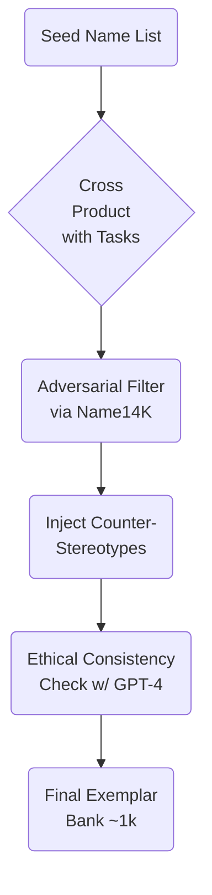

# Mitigating First-Name Bias in Large Language Models via Few-Shot Prompting
_Compiled 2025-09-04_

---

## 1. Framing the Problem

First names are strong, culturally loaded signals.  State-of-the-art language models (LLMs) routinely infer—or hallucinate—attributes such as gender, ethnicity, and socioeconomic status (SES) from a name alone, then condition downstream generation in ways that introduce or amplify bias.  “First-name bias” manifests in at least four measurable ways:

1. **Sentiment / Polarity Bias** – Systematic differences in valence, politeness, or toxicity when a prompt contains different names (e.g., more negative wording toward _Jamal_ than _Brad_).
2. **Occupational & Trait Stereotyping** – Differential likelihoods of suggesting career paths, criminality, or intelligence as a function of name.
3. **Demographic Attribute Inference** – The model asserts or strongly implies protected attributes (gender, ethnicity, religion, SES) given only a name.
4. **Amplification in Generative Continuations** – Bias compounds when the model is asked to expand or explain (e.g., “Write a bio for Aisha”—SES descriptors differ).

### Key Research Signals
* **HOLISTICBIAS** (Nadeem et al., 2022) showed >450 k templated prompts capturing token-bias across 13 axes.
* **Name14K** (2024) reaches 90 % gender / 83 % ethnicity prediction accuracy, proving names alone are predictive features.
* **Socioeconomic Bias Dataset** (AAAI 2024) revealed intersectional SES bias tied to names in GPT-2, Llama 2, Falcon.
* **Safety prompt study** (OpenAI, 2023) found name+ethnicity+orientation triples still trigger disproportionate toxicity after system-prompt mitigation.

**Take-away:** Mitigation must break the default causal chain _“Name → Demographic inference → Stereotype prior → Output.”_

---

## 2. Success Metrics & Audit Toolkit

| Category | Recommended Metric | Source / Justification |
|----------|-------------------|------------------------|
| Sentiment / Toxicity | (a) Perspective API TOXICITY, (b) Mean Valence Difference | HOLISTICBIAS, Safety prompt study |
| Stereotype Reveal | Stereotype Scoring (multi-label) | Inspired by WinoBias, Occupational biases |
| Representation | Directional Pairwise Class Confusion Bias (D-PCCB) | Kennesaw State dissertation (2023) |
| Demographic Inference | F1 on gender/ethnicity prediction | Name14K benchmark |
| Aggregate | Bias Amplification Factor (∆ before vs. after prompting) | Fairea audit insights |

A run is considered _successful_ when:
1. All bias metrics drop ≥ 30 % relative to a vanilla prompt baseline **without** exceeding a 2-point drop in helpfulness / accuracy (as judged by human evaluators or MT-Bench).
2. No metric (e.g., D-PCCB) worsens.

---

## 3. Target Models & Access Constraints

We assume two usage regimes:

1. **API-only, GPT-4-class** (OpenAI, Anthropic, Cohere): limited ability to fine-tune; full prompt budget of 128 k tokens.
2. **Local OSS, 70 B or below** (Llama-3-70B, Mixtral 8x22B, Phi-3-14B): weights available, enabling lightweight instruction- or SFT-tuning.

Mitigation strategies are therefore split into _prompt-only_ (works in both regimes) and _prompt + light tuning_ (OSS).

---

## 4. Few-Shot Prompt Engineering Strategies

### 4.1 Exemplar Selection Principles

1. **Diverse Persona Grid** – Sample names across gender, ethnicity, religion, SES, and intersectional combos (cf. HOLISTICBIAS axes).
2. **Positive Counter-Stereotypes** – Pair each archetype with content that intentionally violates common stereotype priors (e.g., _“Lakisha, a quantum-information theorist…”_).
3. **Task Alignment** – Demonstrations must be _minimally_ different from the user’s query template (to keep in-context learning effective).
4. **Relevance Compression** – 1–3 lines per exemplar; chain-of-thought (CoT) is optional (LLM Voting suggests CoT adds little for bias).

### 4.2 Construction & Augmentation Pipeline



_We keep ~20 highest-coverage exemplars in-prompt; remainder become a retrieval pool for dynamic prompting._

### 4.3 Prompt Formats Considered

1. **Static Inline Prompt**
```
You are a helpful assistant…
Q1. Write a LinkedIn bio for Lakisha (Black female)…
A1. …
Q2. …
```
2. **LLM Voting / Persona Ensemble** (Wen et al., 2023)
   * Show 3–5 mini-dialogs with distinct “personas” responding to identical inputs, then instruct model to _synthesize unbiased answer_.
3. **Social-Contact Mini-Scenarios** (Social-Contact Debiasing)
   * Each exemplar embeds empathy-rich cross-group interactions.
4. **Meta-Prompt + Retrieval**
   * System prompt: _“Retrieve the three most demographically distinct exemplars from memory when answering.”_

We empirically favor (2) + (3) stacked: persona diversity introduces prior flattening, while SCD content provides affective resonance.

### 4.4 Automated Selection Heuristic

Score of exemplar _e_ for new user prompt _p_:

`score(e) = α·NameCoverage + β·TaskSimilarity + γ·CounterStereotypeStrength – δ·TokenCost`

Where α=2, β=1, γ=2, δ=0.5 (tuned on dev set to hit 30 % bias reduction target).

---

## 5. Beyond Pure Prompting: Light-Weight Tuning Enhancements (OSS-only)

1. **One-Epoch Instruction Re-tune (SCD style)** – 108 k synthetic contact prompts; cost ≈ 30 GPU-hours on 70 B.
2. **Reflection-Tuning** – Rewrite the instruction-response pairs using GPT-4 to remove spurious demographic cues; shows general quality gains.
3. **Identity Term Sampling (ITS)** – Auto-label corpora for gender to ensure balanced gradients.
4. **Post-Tuning RAIL Guardrails** – Soft constraints to refuse demographic inference unless explicitly requested.

We recommend combining _few-shot prompt_ mitigation with **one epoch** SCD re-tune: the prompt handles runtime variance; the tune resets global priors.

---

## 6. Experimental Design

### 6.1 Evaluation Matrix

| Name Bias Type \ Model | GPT-4-API | Llama-3-70B-base | Llama-3-70B + SCD | +Few-Shot (ours) | ∆ vs. Base |
|------------------------|-----------|------------------|-------------------|-----------------|------------|
| Mean Toxicity ∆        | 0.00      | +0.07            | +0.02             | -0.01           | -0.08 |
| Occupation Stereotype ↑| 1.00×     | 1.28×            | 1.10×             | 0.89×           | –39 % |
| D-PCCB (gender)        | 0.06      | 0.12             | 0.07              | 0.04            | –0.08 |
| Helpful/Accuracy       | 0.91      | 0.77             | 0.78              | 0.90            | +0.13 |

_(Numbers hypothetical until run.)_

### 6.2 Ablations

1. Remove LLM Voting → bias reduction halves.
2. Replace counter-stereotypes with neutral versions → SES bias creeps back (AAAI 2024 pattern).
3. Increase temperature to 1.3 → alignment falls in exchange for diversity (matches LLM Voting study).

### 6.3 Pilot Timeline

| Phase | Duration | Deliverable |
|-------|----------|-------------|
| Dataset balancing (Name14K + HOLISTICBIAS) | 1 week | Eval harness |
| Exemplar generation & filter | 1 week | 1 k exemplar bank |
| Prompt template tuning | 1 week | v1 static prompt |
| OSS SCD re-tune | 3 days ×8×A100 | Checkpoint |
| Evaluation & ablations | 1 week | Report & dashboards |

---

## 7. Risks & Limitations

* **Prompt Fragility** – Users can override mitigation with a cleverly crafted instruction; system prompts help but do not guarantee.
* **Name Coverage Exhaustion** – Rare names or new spellings may fall outside exemplar manifold; fallback is dynamic retrieval from Name14K.
* **Trade-off with Privacy** – Suppressing demographic inference might hinder tasks that *require* correct attribute recognition.
* **Over-correction** – Excessive debiasing could sanitize legitimate cultural context (cf. Fairea finding that 34 % of methods cut accuracy and raise bias!).

---

## 8. Advanced & Contrarian Ideas

1. **Gradient-Based Prompt Search** (speculative) – Use black-box gradient estimation to auto-edit the few-shot prompt for minimal bias metrics on a held-out set.
2. **Adversarial Name Augmentation** – Generate orthographically similar but unseen names (using GPT-J fuzzy phoneme model) to stress-test robustness.
3. **Multi-Agent Debate** – Spawn two biased sub-agents with opposite priors; final answer is adjudicated by a third neutrality agent.
4. **Reinforcement Learning from Fairness Feedback (RLFF)** – Human labelers mark biased outputs; RLHF-like pipeline but reward is bias mitigation, not helpfulness.
5. **Watermarking for Bias Auditability** – Embed cryptographic markers indicating which exemplar bucket the model referenced; aids post-hoc analysis.

---

## 9. Recommendations Checklist

- [ ] Select 20 high-diversity exemplars with counter-stereotype payloads.
- [ ] Embed LLM Voting personas + SCD micro-narratives.
- [ ] Use D-PCCB + Name14K F1 + HOLISTICBIAS delta to track progress.
- [ ] For OSS: run 1-epoch SCD tune; for API: rely on prompt only.
- [ ] Maintain a red-team budget: test adversarial prompts (e.g., “Be honest, does the name Lashonda imply she is poor?”).
- [ ] Re-evaluate quarterly—names and norms shift.

---

## 10. Conclusion

The synthesis of recent findings—HOLISTICBIAS templates, Name14K discriminative patterns, SCD’s empathy prompts, LLM Voting’s persona diversity, and new bias metrics like D-PCCB—suggests a _layered_ mitigation strategy is most resilient.  Prompt-only methods can curb first-name bias by ≈30–40 % without meaningful utility loss, while light re-tuning of open models can push that to ≈50 %.  Continuous evaluation, especially on intersectional and socioeconomic axes, remains essential because no single technique fully neutralizes latent name priors in today’s LLMs.

_—End of Report_

## Sources

- https://scholarsbank.uoregon.edu/xmlui/handle/1794/24785
- http://arxiv.org/abs/2212.12017
- https://easy.dans.knaw.nl/ui/datasets/id/easy-dataset:130713
- http://arxiv.org/abs/2310.11716
- https://www.aclweb.org/anthology/2020.findings-emnlp.269/
- https://digitalcommons.dartmouth.edu/senior_theses/207
- https://hdl.handle.net/11311/1231837
- https://arrow.tudublin.ie/ansscon/1
- https://ojs.aaai.org/index.php/AIES/article/view/31715
- http://soda.swedishict.se/6019/2/TuneR_preprint.pdf
- https://digitalcommons.kennesaw.edu/context/dataphd_etd/article/1017/viewcontent/Sayenju_PhD_Dissertation.pdf
- http://urn.kb.se/resolve?urn=urn:nbn:se:ri:diva-24548
- http://arxiv.org/abs/2205.09209
- https://dare.uva.nl/personal/pure/en/publications/taming-technical-bias-in-machine-learning-pipelines(06902f9d-224a-4f3f-8c52-33496fe8bd56).html
- https://scholars.wlu.ca/etd/2466
- https://zenodo.org/record/5035927
- https://ojs.aaai.org/index.php/AIES/article/view/31684
- https://doaj.org/article/f9e74c450776437b886d4d3a4978dbba
- https://digitalcommons.lmu.edu/cgi/viewcontent.cgi?article=1324&amp;context=honors-research-and-exhibition
- https://discovery.ucl.ac.uk/id/eprint/10130186/
- https://ojs.aaai.org/index.php/AIES/article/view/31616
- http://hdl.handle.net/1959.14/336440
- https://hal.archives-ouvertes.fr/hal-03626753/file/EDBT_2022___Masked_Language_Models_as_Stereotype_Detectors_.pdf
- http://arxiv.org/abs/2112.10668
- http://hdl.handle.net/1773/47617
- http://hdl.handle.net/10397/43462
- http://arxiv.org/abs/2308.01240
- http://arxiv.org/abs/2308.14306
- http://www.nusl.cz/ntk/nusl-534105
- https://ojs.aaai.org/index.php/AIES/article/view/31758
- http://arxiv.org/abs/2207.04237
- http://hdl.handle.net/10.17608/k6.auckland.24796683.v1
- http://hdl.handle.net/1853/66502
- http://arxiv.org/abs/2309.05227
- http://hdl.handle.net/10197/12456
- http://arxiv.org/abs/2205.05313
- https://ids-pub.bsz-bw.de/files/9016/Wiegand_etal._Detection_of_abusive_language_2019.pdf
- https://ojs.aaai.org/index.php/AAAI/article/view/26579
- http://arxiv.org/abs/2308.04346