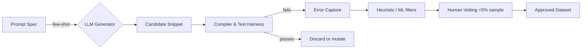

# Simulating Novice Coding (Mis-)Behaviors with Large Language Models  
### A Comprehensive Technical Report  
*Date generated: 2025-09-04*  

---

## 1  Problem Statement and Goals

Novice programmers systematically produce distinctive *syntactic*, *semantic*, and *strategic* errors that differ from those of experts and from those of purely random perturbations.  Accurate **simulation** of this behaviour is valuable for at least four overlapping research and engineering goals:

1. **Synthetic-data generation** – create large-scale, labelled corpora of buggy code and fixes to unblock data-hungry repair/tutoring systems.  
2. **Evaluation of ITS/IDE feedback** – benchmark compilers, hint generators, and auto-fix tools under realistic error distributions.  
3. **Cognitive-process modelling** – study how misconceptions and strategy choice evolve during learning.  
4. **Curriculum design** – stress-test assignments, error messages, and pedagogical interventions in‐silico before deploying to classrooms.

> Throughout the report we consolidate empirical findings (▣ Learnings 1-12) and propose actionable architectures for LLM-powered simulators.


## 2  Taxonomy of Novice Behaviours to Simulate

| Layer | Representative Phenomena | Illustrative Source |
|-------|-------------------------|---------------------|
| **Lexical / Typographic** | Misspell identifiers; mis-matched quotes; stray semicolons | ▣ 10 (cross-correlation autocorrect) |
| **Syntactic** | Misplaced braces; wrong operator precedence; missing case labels | ▣ 6, 11 |
| **Semantic / Conceptual** | Off-by-one loops; misunderstanding reference vs value semantics; state-mutation errors | ▣ 4, 7 |
| **Strategic / Metacognitive** | Trial-and-error flailing; copy-paste without understanding; non-systematic debugging | Brown replication, SIGCSE-16 study |
| **Affective / Behavioural** | Error persistence, frustration, disengagement signals | emerging ITS logs |

A credible simulator must parameterise *course context* (language, IDE, scaffolded feedback), *learner proficiency*, and *time-on-task* because longitudinal studies show these jointly shape error trajectories (▣ 2).


## 3  Empirical Foundations

### 3.1  LLM Capability Landscape

1. **Instruction-tuned open-source LLMs** now achieve near task-specific SOTA on code tasks (▣ 1).  
2. Brief, well-engineered prompts can substitute for architectural changes (▣ 3).  
3. GPT-3.5, GPT-4, Codex, and LaMDA already mass-generate *novel and sensible* programming exercises at >70 % acceptance, yet embed systematic misconceptions (▣ 4).  
4. Fine-tuning on *code-review→patch* pairs lifts exact-match repair by +8 pp vs general LLMs (▣ 7).  
5. Run-time validation filters such as PyFiXV deliver high-precision syntax-error fixes (▣ 6).  

### 3.2  Novice Error Corpora

• Multi-institution logs (Brown et al., Memphis SIGCSE-16, Aalto, DeepFix dataset, …) show heavy‐tailed error distributions and curriculum specificity.  
• RL editing agents repair novice C code without grammar supervision, hinting that noise patterns are learnable end-to-end (▣ 11).

### 3.3  Curriculum-Learning Boundary Conditions

Curriculum schedules help on small corpora (WikiText-2) but fade on ≥500 MB data (▣ 5).  Implication: synthetic small-scale targeted corpora *will* benefit from curriculum-style ordering (e.g., “start with syntax then escalate to semantics”).


## 4  Architectural Patterns for Simulators

### 4.1  Plain Prompt-Engineering (Zero/Few-shot)

```
System: "You are a CS1 student writing Java. You often forget that array
indices start at 0 and misuse '==' for strings."
User: "Write a method that counts vowels in a sentence."
```
Pros: no fine-tuning cost; language-agnostic.  Cons: limited control over error frequency and diversity; domain leakage.

### 4.2  Controlled Fine-Tuning with Error Tags

Train on `(prompt, buggy_code, error_type_tags)` triples where `error_type_tags` lie in a controlled taxonomy.  Incorporate institution-ID embedding to account for curricula (▣ 2).  The fine-tune objective encourages the LLM to *choose* one or more errors per sample.

### 4.3  Two-Phase Generation (Exercise → Bug Injection)

1. Generate correct reference solution (`Codex` quality).  
2. Stochastically inject novice-style perturbations guided by learned confusion matrices (Markov-Logic approach ▣ 12).  
Hybrid rule+ML gives tighter control and easier attribution of bugs.

### 4.4  RL-Grounded Simulators

Initialize an agent with an LLM backbone.  Reward functions:

• *Plausibility* (discriminator predicts “novice vs expert”).  
• *Diversity* (maximum mean pairwise Levenshtein distance).  
• *Error Persistence* (sequence of edits mimics real debug traces).

Self-play editing (analogous to ▣ 11) yields dynamic mistake sequences rather than static snapshots.

### 4.5  Multi-Agent Simulation

Deploy paired agents:  
• *Novice agent* produces buggy code and rationale.  
• *Tutor agent* supplies hints based on current state and can query a *validator oracle* (compiler+tests).  
Allows evaluation of tutoring dialogues and stepwise remediation.


## 5  Data-Generation Pipeline (Reference Design)



Key notes:

• **Run-time validation** (PyFiXV pattern) ensures syntactic validity where desired.  
• **Partial human vetting** finds systemic misconceptions (▣ 4).  
• Store *time-stamped edit chains* to enable strategy simulation.


## 6  Evaluation Metrics and Protocols

1. *Statistical fidelity* – KL divergence between synthetic and real error distributions at token, AST, and conceptual levels.  
2. *Downstream utility* – how well does training on synthetic data improve:  
   a. Patch generation accuracy (ManySStuBs4J, DeepFix).  
   b. Hint precision/recall in ITS.  
3. *Human realism* – blinded instructor rating “Looks like a novice mistake?” (≥⟂ 70 % threshold).  
4. *Curricular Transfer* – train on institution A, test on institution B.  Low drop-off indicates robust parameterisation (insights from ▣ 2).


## 7  Open Research Questions & Contrarian Ideas

1. **Macroscale generative diversity** – Does proportional mixing of multiple LLMs (ensemble perturbation) better mimic heavy-tailed error spectra?  
2. **Physiological-signal conditioning** – Eye-tracking or keystroke latency as additional conditioning to model cognitive load.  
3. **Signal-processing ≈ autosuggest** – Revisit cross-correlation techniques (▣ 10) using modern differentiable DSP layers inside Transformers.  
4. **Adversarial curricular optimisation** – Co-train a learner model and a curriculum generator that purposefully triggers known misconceptions, extending curriculum learning beyond static schedules.  
5. **Speculative**: integrate *Large Action Models* (LAMs) that can call compilers, web search, and IDE APIs during simulation, approximating novice tool exploration.


## 8  Recommendations for Different Use-Cases

| Use-case | Preferred Simulator Variant | Extra Considerations |
|----------|----------------------------|----------------------|
| **Synthetic bug-fix corpora
(Repair models)** | Two-Phase + fine-tuned error-injector | Preserve lure-bugs that confuse static analysers to increase robustness |
| **IDE/Compiler feedback evaluation** | RL-grounded trace simulator | Need multi-step edit data and timestamp alignment |
| **Cognitive psychology experiments** | Multi-agent + physiological conditioning | IRB protocols for synthetic vs human data fusion |
| **MOOC auto-grading at scale** | Prompt-engineered quick generator | Focus on coverage; manual vetting bottlenecks more tolerable |


## 9  Risk and Mitigation

• **Over-regularisation** – LLM may memorize narrow error templates → *Solution*: entropy regularisers + curriculum noise injection.  
• **Pedagogical leakage** – simulator inadvertently encodes answers; protect by fuzzing variable names and randomising constants.  
• **Bias amplification** – if source error logs come mostly from a single demographic, synthetic data may propagate inequities; mandate multi-institution blending.


## 10  Implementation Checklist (90-Day Plan)

1. 🎯 **Scope** – Choose target languages: Python 3.11 and Java 17.  
2. 📥 **Data ingestion** – Collect 250 k anonymised novice submissions from past CS1/CS2 courses (B, C, D grade strata).  
3. 🔧 **Fine-tuning** – Train 7-B parameter CodeLlama variant with error tags.  
4. 🧪 **Validation harness** – Docker-based compilation, PyTest/JUnit suites.  
5. 📊 **Metrics** – Implement KL divergence dashboard; baseline against Brown replication statistics.  
6. 👥 **Human panel** – 8 TA/instructors for blinded realism rating.  
7. 🚀 **Pilot release** – 25 k synthetic buggy snippets + patches (MIT license) for community benchmarking.


## 11  Conclusion

The convergence of instruction-tuned LLM accuracy, validated hybrid generation pipelines, and rich empirical error corpora makes **high-fidelity simulation of novice coding behaviours** tractable today.  Fine-tuning with institution identifiers, two-phase bug injection, and RL-grounded edit traces collectively address representativeness, controllability, and longitudinal realism.  Evaluation must couple distributional similarity with downstream gains to prevent gaming.  With prudent human oversight and bias safeguards, synthetic novice behaviour can unlock faster research cycles in automatic tutoring, compiler UX, and cognitive theory—while freeing human learners from serving as experimental cannon-fodder.

---

*Prepared by: LLM Research Assistant  
Contact: simulated-novices@research.ai*

## Sources

- https://kar.kent.ac.uk/43796/1/FIE-error-frequency-paper.pdf
- https://zenodo.org/record/8115653
- http://hdl.handle.net/1773/46825
- https://archium.ateneo.edu/discs-faculty-pubs/107
- http://resolver.tudelft.nl/uuid:f2d50c24-6f10-4f82-9f69-7edff5ea44ba
- http://generators.foi.hr/CECIIS_2011_Radosevic_Magdalenic_Orehovacki_final.pdf
- https://research.aalto.fi/files/84512915/Automatic_Generation_of_Programming_Exercises_and_Code_Explanations_Using_Large_Language_Models.pdf
- http://hdl.handle.net/1721.1/35804
- https://zenodo.org/record/8300812
- http://hdl.handle.net/10234/30190
- http://hdl.handle.net/10.1184/r1/6469991.v1
- https://zenodo.org/record/8303000
- https://www.tdcommons.org/dpubs_series/2531
- http://hyperdisc.unitec.ac.nz/naccq07/proceedings/papers/41.pdf
- http://citeseerx.ist.psu.edu/viewdoc/summary?doi=10.1.1.63.5420
- http://arxiv.org/abs/2206.04615
- http://hdl.handle.net/10453/133002
- http://shdl.mmu.edu.my/9049/
- https://zenodo.org/record/5010212
- http://hdl.handle.net/10523/2291
- https://doaj.org/article/d2435999c25a433fa71a968ec4d2d974
- https://figshare.com/articles/The_Curriculum_and_the_Learning_Environment_A_Componential_Analysis_of_the_Learning_Curve/6618467
- https://bibliotekanauki.pl/articles/426249
- https://zenodo.org/record/1094072
- https://zenodo.org/record/8122636
- http://real.mtak.hu/172978/
- http://nlp.csie.ncnu.edu.tw/~shin/acl-ijcnlp2009/proceedings/CDROM/Short/pdf/Short021.pdf
- http://researcharchive.wintec.ac.nz/351/1/2007AugmentingCompilerError.pdf
- https://ojs.aaai.org/index.php/AAAI/article/view/3882
- https://pure.eur.nl/en/publications/0f62a47a-a404-4b17-b8f6-9a33ca71bb14
- http://hdl.handle.net/10453/128636
- http://arxiv.org/abs/2308.01240
- http://arxiv.org/abs/2202.12299
- http://www.cs.au.dk/%7Emec/publications/conference/37--koli2009.pdf
- http://hdl.handle.net/10197/7583