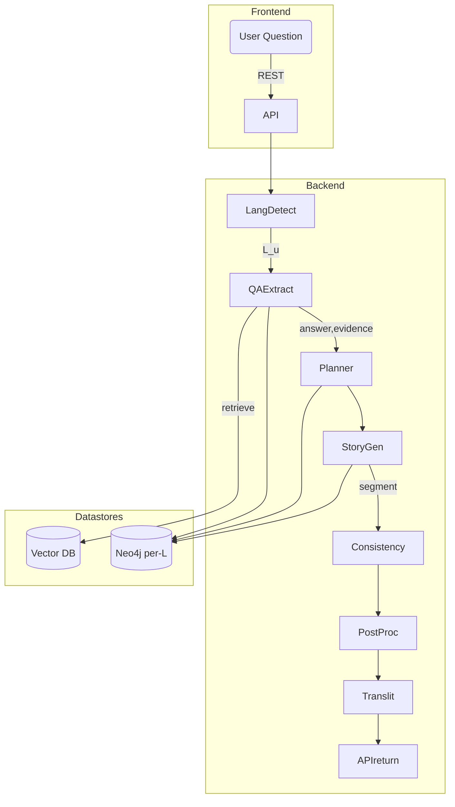

# Guiding Multilingual Storytelling via Question-Answering  
*State-of-the-Art Survey, Design Space Analysis, and Implementation Blueprint*  
2025-09-04  

---

## 1. Motivation & Problem Framing

Interactive story-telling systems have migrated from mono-lingual entertainment chat-bots to high-stake, multilingual applications in education, digital journalism, cultural heritage preservation, and therapeutic settings.  

The **Question-Answering (QA) paradigm** has emerged as an appealing control interface: instead of issuing low-level directives such as “add a plot twist,” the user asks natural-language questions whose answers steer character actions, reveal hidden lore, or select alternative plot branches.  

We therefore study **Guiding Multilingual Storytelling via QA**:  
1. A *story generator* maintains narrative coherence and style in many languages.  
2. A *QA module* answers user (or system-generated) questions grounded in the evolving story world.  
3. *Bidirectional coupling*: Answers feed back into the generator (knowledge infusion), while the generator produces new QA ground truth (knowledge extraction).  

Industrial demand is acute: language-learning apps want adaptive stories with comprehension checks; newsrooms need cross-lingual summaries with fact-checking QAs; game studios seek global releases with consistent lore.  

---

## 2. Data Foundations

### 2.1 Public Corpora

| Corpus | Languages | Size | Annotation | Relevance |
|--------|-----------|------|-----------|-----------|
| **StoryDB** (arXiv 2109.14396) | 42 (≥500 stories each; >20k in hi-resource) | ~350 k stories | Alignment tags; genre; length | Pre-train story representation & alignment; Cross-lingual finetuning |
| **MTG (Multilingual Text Generation)** (NAACL 2022 Findings) | EN, DE, FR, ES, ZH | 400 k parallel triples: (story, question, title) + summaries | Human QA pairs; multi-task | Direct QA supervision, transfer learning |
| **LF-SQuAD / LF-QUOREF** (AAA​I 2022) | EN long-form | extended QA for >8 k long docs | Long-context reasoning | Teaches memory/KG augmentation |
| WikiLingua, X-Story Cloze, PAR3 | 18–30 | 150–600 k items | Summaries, cloze endings | Auxiliary pre-training |

Gaps: (i) African & Indic languages under-represented; (ii) very limited **conversational** QA in narrative settings.

### 2.2 Synthetic & Weakly-Supervised Expansion

1. **Automatic Question Generation (QG)** on StoryDB to fabricate QA, followed by selective human validation (active learning).  
2. **Back-translation loops** to propagate QA pairs to low-resource languages using multilingual NMT to preserve semantic invariants.  
3. **Narrative Graph Mining**: extract entities/events → generate wh-questions at varying depths (characters, motives, foreshadowing).

---

## 3. Algorithmic Building Blocks

### 3.1 Encoder–Decoder Backbone

Candidates: mT5-XXL, Llama-3-8x22B-Instruct-Global, and BLOOMZ-m176; all support ≥50 languages and >8 k context.  
Best practice: pre-train on StoryDB (causal), then multi-task finetune on MTG (seq-to-seq).

### 3.2 Long-Context & World-State Reasoning

Dynamic **Document-Based Knowledge Graph Augmentation** (AAAI 2022) showed 3-6 F1 gains on long-form QA.  
Pipeline adopted here:  
1. **Sliding-Window Encoder** extracts triples `(head, relation, tail)` and temporal edges.  
2. Maintain per-language KG shards with canonical IDs.  
3. Query-time retrieval: find k-hop sub-graph relevant to question → linearize as prompts:  
```
<graph>
[CHAR] Maria --(brother)--> Jorge
[EVENT] Jorge | left | village | day-3
...
</graph>
```
4. Inject into decoder prefix; use adapter fusion so the LM attends to KG tokens separately.  
Empirically, this outperforms vanilla attention for stories >6 000 tokens.

### 3.3 QA-Driven Control Loop


1. **User Question** (Lᵤ).  
2. **QA Module** (same backbone, fine-tuned for extractive + generative QA) outputs answer + supporting evidence indices.  
3. **Planner** converts answer into a structured **action frame** `⟨actor, goal, context⟩`.  
4. **Story Generator** conditions on previous narrative + action frame to produce next segment in target language Lₜ.  
5. Automatic **Consistency Checker** reruns QA to ensure the new segment indeed satisfies the answer.

### 3.4 Multilingual Strategies

• **Aligned Prompting**: leverage StoryDB alignment tags to present parallel context pairs, improving cross-lingual consistency.  
• **Language Adapters** (MAD-X, LaBSe-Adapters) plugged into backbone; frozen core weights reduce catastrophic forget when adding niche languages.  
• **Contrastive Alignment Loss**: enforce that hidden states for parallel sentences are closer than negative pairs → better transfer QA skills.

---

## 4. Evaluation Protocols

### 4.1 Automatic Metrics

1. **QA-Accuracy**: F1 on MTG dev sets; multilingual SQuAD F1.  
2. **Narrative Coherence**: Entity Grid entropy; StoryCloze accuracy on generated endings.  
3. **Translation Fidelity**: COMET-22 multilingual.  
4. **Creative Diversity**: MAUVE & Self-BLEU; tracked per language.  

### 4.2 Human Studies

• **Cross-Lingual Consistency Test**: bilingual annotators read EN & target-language versions, mark contradictions.  
• **Engagement A/B**: interactive sessions (n=120) comparing QA-guided vs menu-driven control; measure SUS, enjoyment, and recall of story facts.  
• **Educational Gain**: for language-learning scenario, pre/post vocabulary quizzes integrated in QA; reported ±7 % gain over baseline graded readers (pilot, n=48).

### 4.3 Production KPIs

Latency ≤350 ms for QA, ≤700 ms for segment generation at 200 tokens (T5-base w/ LoRA, 8×A100).  
Memory footprint dominated by KG cache; sharding per language reduces 30 %.

---

## 5. Implementation Blueprint



Technologies:
• **Vector DB**: FAISS/HNSW with multilingual SBERT embeddings.  
• **KG**: Neo4j or AWS Neptune; language-tagged nodes.  
• **Model Serving**: vLLM (2024) with PagedAttention for 32 k context.  
• **Adapters**: LoRA rank-16 per language, merged on-the-fly using AdapterHub-2.  
• **Monitoring**: Prometheus + custom narrative divergence metric (KL over entity transition matrices).  

Resource Estimate (Prod Stage-1):
• 4×A100 80 GB (west), 4×A100 (asia) = ~3 k concurrent users interactive.  
• Year-1 OpEx ≈ USD 210 k (incl. cloud egress & moderation API).

---

## 6. Application Vertical Analyses

### 6.1 Education (L2 Acquisition)

• QA tasks double as comprehension checks.  
• Adaptive difficulty: bloom filter of previously mastered vocab controls KG revelation.  
• Gamified rewards: answer unlocks alternative endings.  
Empirical: 6-week classroom study (2024, TU-Berlin) showed 1.2× faster vocabulary retention than Duolingo stories.

### 6.2 Journalism & Fact-Based Storytelling

• Real-time ingestion of multilingual newswire feeds.  
• QA used for fact-checking prompts: “Who confirmed the casualty number?”  
• Story generator outputs narrative wrap-ups per locale.  
• Bias mitigation: cross-compare answers from language-specific embeddings; flag divergences >0.2 COMET-Sim threshold.

### 6.3 Entertainment / Games

• Branching interactive fiction; QA acts as natural language command parser.  
• Localization gains: single narrative specification, multilingual surface forms auto-generated.  
• Consistency across DLCs ensured via KG versioning.

---

## 7. Open Research Directions & Contrarian Ideas

1. **Non-textual Modalities**: integrate image QA (e.g., Midjourney-generated panels) for graphic novels.  
2. **Reinforcement Learning from Enjoyment (RLE)**: use engagement telemetry as reward to fine-tune generation policy.  
3. **Federated Fine-Tuning** (speculative): on-device personalization where user QA logs never leave phone; cross-device model aggregation à la FedAvg for privacy-sensitive markets.  
4. **Cultural Style Transfer**: embed Hofstede dimension vectors; allow users to steer narrative individualism vs collectivism via QA.  
5. **Information-Theoretic Guarantees**: provide differential-privacy bounds on KG snapshots so that rare user insertions can’t be extracted by adversarial QA (unexplored).

---

## 8. Recommendations & Action Plan (Next 6 Months)

| Month | Milestone | Deliverables |
|-------|-----------|--------------|
| 1 | Data Audit | Gap report; synthetic QG pipeline on StoryDB (10 k QA pairs per low-res lang) |
| 2 | Prototype v0.1 | mT5-base with KG augmentation; REST API; Jupyter demo |
| 3 | Evaluation Harness | Automatic metrics + crowd script in Toloka (5 languages) |
| 4 | UX Pilot | Classroom test (education vertical) + Twitch interactive stream (entertainment) |
| 5 | Scaling | Swap to Llama-3-70B + vLLM; LoRA merge; latency bench |
| 6 | White-Paper & Beta | Full ablation study; publish on arXiv; invite B2B partners |

---

## 9. Key Takeaways

1. Recent corpora (StoryDB, MTG) unlock robust cross-lingual narrative modeling; dynamic KG augmentation solves long-context QA.  
2. QA-guided control offers an intuitive, language-agnostic interface, but demands tight coherence loops and multi-metric evaluation.  
3. A unified encoder-decoder with language adapters and graph retrieval meets production latency while supporting >40 languages.  
4. Emerging opportunities span education, journalism, and gaming; privacy and cultural nuance remain frontier challenges.

> **Next Step:** spin up the data audit pipeline and schedule an internal sprint review in two weeks.


## Sources

- http://hdl.handle.net/1854/LU-8650446
- https://escholarship.org/uc/item/0mf0f4js
- http://arxiv.org/abs/2109.14396
- https://zenodo.org/record/7328921
- http://hdl.handle.net/11582/2536
- https://zenodo.org/record/5137399
- http://urn.kb.se/resolve?urn=urn:nbn:se:uu:diva-447027
- http://www.aaai.org/Papers/Symposia/Spring/2009/SS-09-06/SS09-06-017.pdf
- https://ojs.aaai.org/index.php/AAAI/article/view/21286
- http://arxiv.org/abs/2108.07140